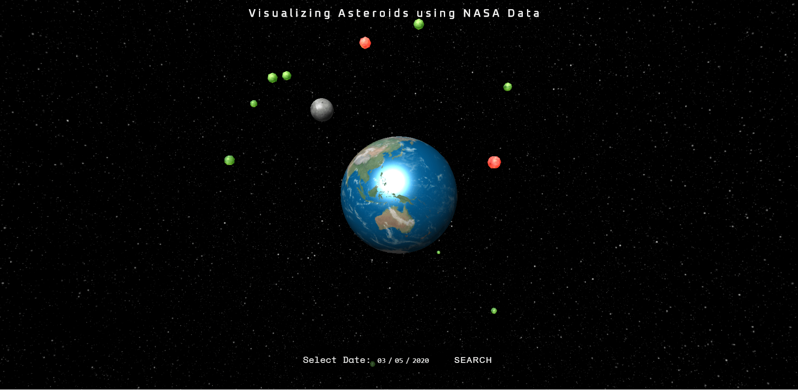
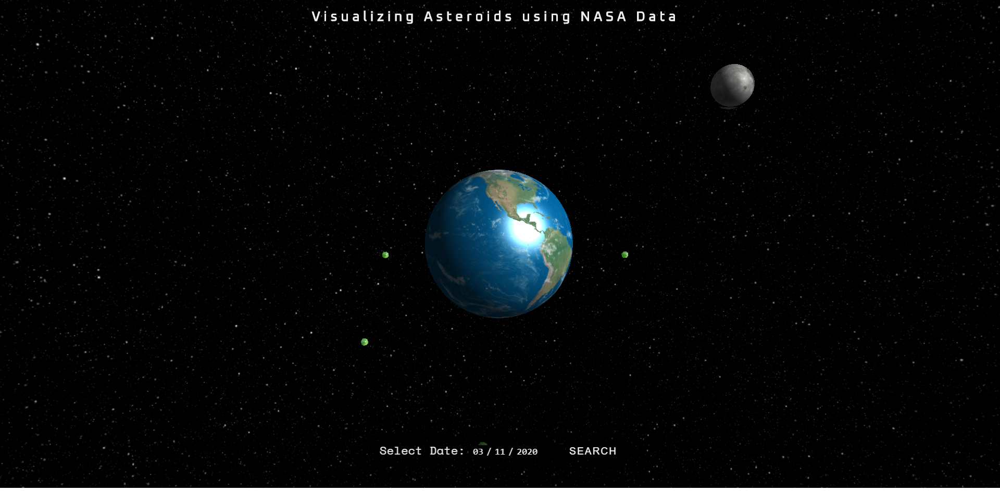
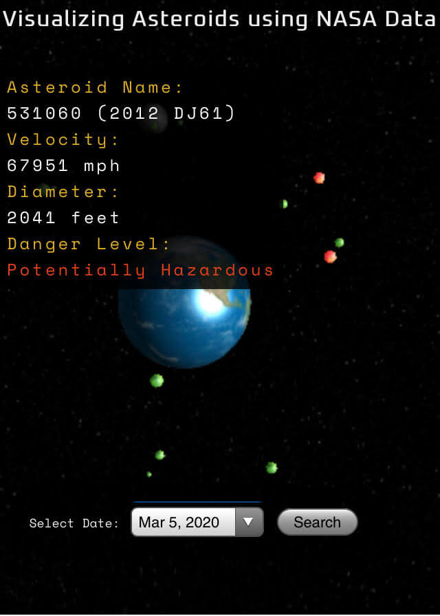
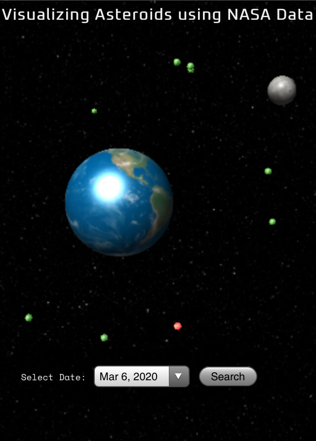

# Visualizing Asteroids in 3D using NASA Data

Interactive, scalable, 3D rendering of earth with nearby asteroids. Each asteroid is designed to reflect their relative size, distance from earth, and highlighted to reflect potential dangers. User can interact in all three dimensions, expand, shrink, and rotate using the mouse, touch, or keyboard. Data is dynamically rendered based off of user click/touch.

## Motivation

We wanted to create a visually striking way to learn more about outer space, and provide users the ability to travel through time to see what kind of floating rocks have passed by our blue ball of gas.

## Screenshots

Desktop Views:

Mobile Views:

## Built With

* HTML
* CSS
* Javascript / jQuery
* WebGL
* Three.js

## Demo

[Live Demo](https://uncultivatedrabbit.github.io/Asteroid-Finder-API-Hack/)

## Authors

1. Brandon Melendez
2. Marlo Jones